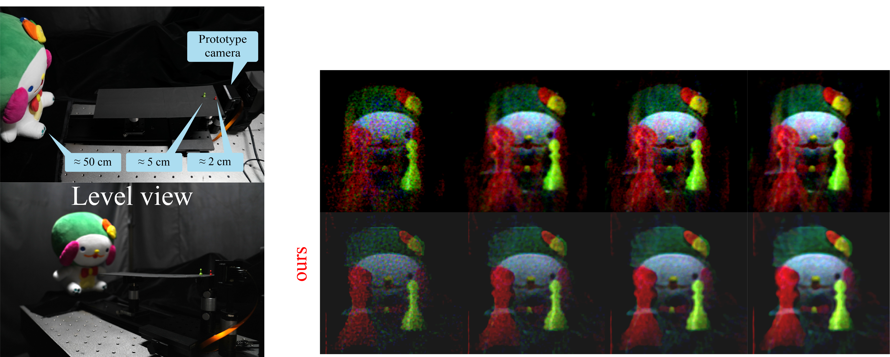

# Toward all-in-focus lensless imaging with full-aperture radial masks (Optics Express 2025)

---


## Abstract (Summary)

In this work we show that radial patterns enable wider depth-of-field lensless imaging, while also enabling efficient modeling of the lensless imaging system with full-aperture masks. This allows us to capture longer continuous scenes than previous approaches, with a competitive inference time and reconstruction quality.

[//]: # (![image info]&#40;./data/figs/OE_website.png&#41;)

---
## Path to data

The data for each of the experiments on the paper are as follows:

* Section 4 (Analysis of PSF depth dependence from correlation): ```./data/prototype/psf/*```
* Section 5 (MNIST digit reconstruction): [Link](https://drive.google.com/drive/folders/1jGzla24lFX_K94enwyX0LOKufQZwySrF?usp=sharing)
* Section 6: (QR codes reconstruction): [Coming soon]()
* Section 7: (Artificially-extended convolution experiments): ```./data/prototype/monitor/*```, ```./data/prototype/two_pawns_sanken_multiexposureV2/*``` and ```./data/prototype/psfV2/*```

Notes 1: MNIST digit dataset contains 101 images per depth (i.e., 1, 3, 5, 10, 40 cm) per mask type (i.e., restricted- and full-aperture radial masks). This totals to 1010 captures plus reference images (under the ```synthetic/``` folder).   


---
## Code Usage

### 1) Create environment (suggested):
```bash
conda create -n frli -y python=3.11
conda activate frli
pip install torch==2.8.0 torchvision==0.23.0 torchaudio==2.8.0 --index-url https://download.pytorch.org/whl/cu128 
pip install matplotlib==3.10.1 opencv-python==4.11.0.86 tqdm==4.67.1
```

### 2) Run big convolution experiments
The experiments for the artificially-extended PSF deconvolution with our full-aperture mask can be replicated by running the .sh files as:
```bash
./big_conv_prototype.sh
./big_conv_simulation.sh
```
Results will be saved in a new folder ```./results/*``` for both prototype camera and simulated experiments.

Testing on different data (e.g., other PSFs or captures for different systems):
```bash
psf_reso=512
meas_reso=512
iters=10000

python big_conv.py --psf_path "path/to/psf" --meas_path "path/to/capture" --save_path "path/to/save" \ 
--psf_reso $psf_reso --meas_reso $meas_reso --iters $iters
```
Change the flags to your preferred setting.

---
## Citation

Citation will be appropriately filled when the manuscript is published (currently accepted but not published)
```
@article{Neto:25,
author = {Jose Reinaldo Cunha Santos A V Silva Neto and Hodaka Kawachi and Yasushi Yagi and Tomoya Nakamura},
journal = {Opt. Express},
number = {},
volume = {],
pages = {},
year = {2025},
url = {}
} 
```

---
## Partial code
Our experiments used the ADMM code originally sourced (but later modified) from the [DiffuserCam-tutorial](https://github.com/Waller-Lab/DiffuserCam-Tutorial) repository.

---
## Licensing

Our work is published under the OAPA (Open Access Publishing Agreement), thus with copyright of images from our paper being transferred to the Optical Publishing Group. But to the best of our knowledge, data can be reused in non-commercial applications with appropriate citation.